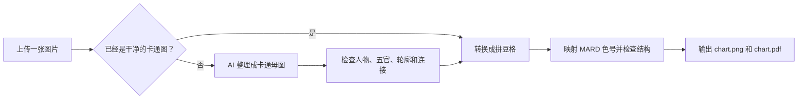

# Make Pindou Pattern｜照片生成拼豆图纸

**上传一张人物、宠物、物品或卡通图片，得到带 MARD 色号的高清 PNG 和可打印 PDF 拼豆图纸。**

你不需要会写 Prompt，也不需要先理解图片处理。普通使用只要安装 Skill、上传图片、说一句话即可。

> 这里的“拼豆图纸”是像素格、MARD 色号和豆子用量，不是传统拼图的切片模板。

## 30 秒开始

### 字节 AgentBuddy 用户

1. 在 AgentBuddy 的 Skill 市场搜索 `make-pindou-pattern`。
2. 安装最新版本并新建一个任务。
3. 上传一张 JPG 或 PNG。
4. 发送下面的最短指令。

```text
请使用 $make-pindou-pattern，把这张图片制作成清晰、可爱的 MARD 拼豆图纸。
```

### Codex 用户

先把下面这句话发给 Codex，让它完成安装：

```text
请从这个 GitHub 仓库安装 make-pindou-pattern Skill：
https://github.com/Syfyivan/make-pindou-pattern
```

安装完成后，在下一条消息或新任务中上传图片，再发送最短指令即可。

> 仅仅下载或收藏 GitHub 仓库不等于已经安装 Skill。安装完成后，Codex 才能自动读取制图规则和转换脚本。

## 普通用户只需要一句话

默认情况下，不需要重复说明“保护脸型、修好眼睛、使用 MARD 色号、控制豆数、导出 PNG/PDF”等要求——这些已经写在 Skill 里。

```text
请使用 $make-pindou-pattern，把这张图片制作成拼豆图纸。
```

只有图片存在歧义或你有特殊偏好时，才需要多补充一句：

| 你想改变什么 | 可以怎么说 |
| --- | --- |
| 指出容易认错的人物特征 | `黑色衣服的人是女生，请保留她的长发。` |
| 指定表情或配饰 | `保留右边男生的白色帽子，让左边女生闭嘴笑。` |
| 控制工作量 | `最多使用 2000 颗豆。` |
| 改变成品用途 | `这是摆件，不要求所有部分连成一片。` |
| 制作挂坠或钥匙扣 | `请做成连体挂坠，并检查容易断裂的位置。` |

如果照片本身足够清楚，Skill 应当直接开始，不会要求你重新背诵一遍质量规则。

## 最终会得到什么

- `chart.png`：高清带网格、MARD 色号和用量统计的图片，适合微信、相册和普通分享。
- `chart.pdf`：单页打印版图纸，可以放大查看而不丢失格子和色号。

普通交付只包含这两个文件，不会额外塞入 SVG、CSV 或调试报告。

## 支持哪些图片

| 图片内容 | 支持情况 | 建议 |
| --- | --- | --- |
| 1–4 人头像或合照 | 最适合 | 脸部尽量清楚、无遮挡；多人挂坠会检查连接结构 |
| 宠物和动物 | 支持 | 保留耳朵、脸型、主要花纹和颜色，适当简化细毛 |
| 玩具、汽车、食物、植物和常见物品 | 支持 | 主体完整、轮廓清楚，避免一次放入很多小物件 |
| 卡通角色、吉祥物、简单 Logo 和图标 | 很适合 | 平涂、粗轮廓、少渐变的图片可以直接转换 |
| 全身人物和复杂服装 | 可以尝试 | 优先保留脸和核心轮廓，主动简化衣服与小配件 |
| 风景、街景、人群和文字很多的截图 | 不推荐直接转换 | 需要先重新设计成少元素、图标化构图 |

推荐使用清晰的 JPG、JPEG 或 PNG。短边约 800 像素以上通常更稳，但主体大小和清晰度比像素数字更重要。不要求提前抠图，也不要求把图片裁成正方形。

## 它会自动负责什么

- 识别并保留主体数量、位置和能够区分身份的特征。
- 人物图优先保护脸型、眼睛、眉毛、嘴和连续眼镜。
- 宠物和物品优先保护外轮廓、主要花纹和定义性部件。
- 默认寻找“豆子最少但仍然好看”的版本：先简化背景、肩膀、衣服、毛发、反光和次要纹理，再考虑降低格数。
- 使用 221 色 MARD 屏幕参考色表，并在图纸中标出 A2、A3、F17 等色号。
- 清理孤立噪点、异常肤色斑点和破碎小块。
- 对挂坠检查是否连成一体，并识别容易断裂的细连接。
- 自动统计总豆数，并按内容设置柔性工作量目标：简单物品约 1200 颗、单人或单宠物约 2000 颗、双主体约 2600 颗、三至四人连体图约 3400 颗。
- 超过柔性目标时会先主动精简一次；如果继续减少会破坏五官、核心轮廓或连接强度，就保留稍高但好看的版本并说明实际颗数。
- 只有你明确说“最多多少颗”时，豆数才是不能超过的硬限制。
- 中间结果不合格时先修正，再交付 PNG 和 PDF。

## 它是怎么工作的



图像模型只负责生成或修正卡通母图。最终格子、色号、颗数、连通性和文件导出由确定性脚本完成，避免让 AI 在图纸里编造色号或漏算豆子。

## 使用前需要知道的边界

### 一张照片够吗？

通常够。只有脸、花纹、隐藏部件或颜色看不清时，才可能需要额外参考图或一句简短说明。

### 每张照片都会一次成功吗？

不能保证。模糊、强逆光、严重遮挡、人数过多或背景过于复杂时，可能需要先修正卡通母图。Skill 的目标是拒绝明显难看或结构危险的图纸，而不是把第一次结果强行当成成品。

### 会不会为了清晰一直增加豆子？

不会。Skill 默认选择“最简单但仍然好看”的候选图，不会为了增加装饰盲目升格。它会从较低格数开始，优先缩短肩膀并删掉背景、衣服褶皱、毛发、反光和小配件；只有五官、脸型、眼镜、主体特征或连接结构仍然不完整时才逐步升格。

约 1200/2000/2600/3400 颗是按内容区分的柔性工作量目标，不是质量死线。超过后会先精简一次；再减就会变丑时，允许少量超过并告诉你原因。只有你明确说“最多使用多少颗”时，才会成为硬性验收条件。

### 会强制限制在 120 格以内吗？

不会。120 格不是脚本上限。转换器保留 256 格的纯技术安全边界，避免单张超大 PNG 耗尽内存；真正需要更大画面时会拆成多张图纸。不过默认流程会保留通过质量检查的最低格版本，不会仅仅因为技术上能做到 256 格就使用更多豆子。

### 需要自己准备 API Key 吗？

转换脚本本身不需要任何 AI Key。照片自动卡通化需要当前 Codex、AgentBuddy 或其他宿主提供图片生成/编辑能力；是否需要订阅、额度或密钥由宿主平台决定。

如果当前环境没有图片生成工具，可以先提供已经确认的卡通图，再使用本仓库的转换脚本生成图纸。这不是安装失败，而是宿主没有提供照片卡通化能力。

### MARD 色号和实物会完全一样吗？

色号来自项目内的 221 色屏幕参考表。显示器、拼豆批次和拍照光线可能造成色差，购买大量材料前建议先用少量实物确认关键肤色和衣服颜色。本项目与 MARD 品牌没有隶属或官方合作关系。

<details>
<summary><strong>高级用户：只转换已经确认的卡通图</strong></summary>

如果你已经有满意的卡通图、图标或平面插画，可以跳过 AI 阶段：

```bash
sh scripts/pindou cartoon.png --output-dir output --grid 72 --colors 22
```

运行环境需要 Python 3 和 Pillow。安装 ReportLab 后会优先生成矢量 PDF，否则会生成高分辨率图片 PDF。

参数说明：

- `--grid`：图纸格数；72 只是起点，120 不是上限。多人脸不清楚时可以提高到 100、140 或更高，单张图纸的技术安全范围是 16–256。
- `--colors`：最大颜色数；人物通常使用 18–30 色。
- `--target-beads`：柔性工作量目标；默认是 `3400`。超过时给出精简提醒，但不会让清晰、好看的图纸验收失败；设为 `0` 可关闭提醒。
- `--max-beads`：可选的用户预算；默认是 `0`，表示只统计豆数、不限制质量。
- `--debug-exports`：诊断时额外输出 SVG、CSV、JSON 和质量报告，普通用户不需要。

</details>

<details>
<summary><strong>开发者：验证和发布 AgentBuddy 包</strong></summary>

运行转换器测试：

```bash
python3 scripts/smoke_test.py
```

测试会生成超过柔性工作量目标的四人连体样例，确认它只提醒而不牺牲质量；同时检查 PNG/PDF 输出、用户硬性豆数预算、连通性和挂坠安全性。

生成 AgentBuddy 本地上传包：

```bash
python3 scripts/package_platform.py --version 1.0.6
```

ZIP 以 `SKILL.md` 为根目录标识，并包含转换脚本、质量规则和 MARD 色号参考文件。

</details>

## License

[MIT](LICENSE)
